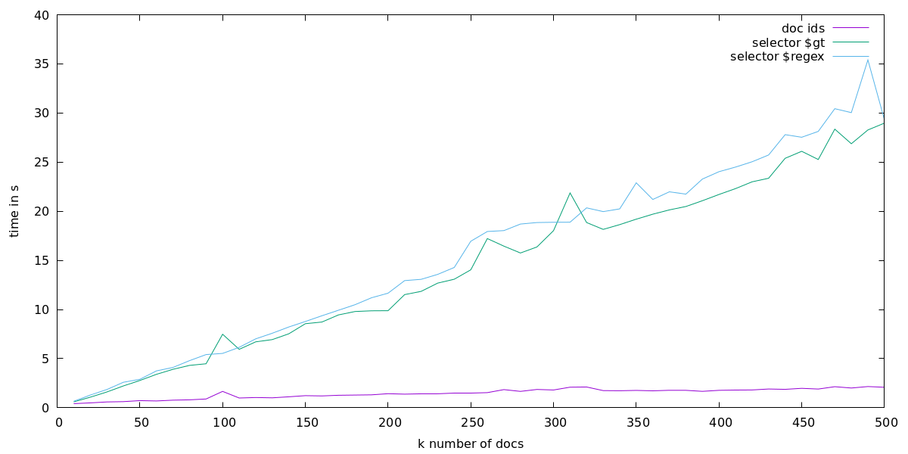

# Evaluating Filtered Replication Performance
This includes scripts to run performance tests against CouchDB to evaluate changes feed filtering performance, which directly relates to the filtering part of replication performance.

We are testing three different filtering options:

* built-in `doc_ids` filter with 20k ids
* ~~Mango selector using `$in` operator for `_id` against 20k ids~~ (disabled bc of poor performance)
* Mango selector using `$gt` for `_id`
* Mango selector using `$regex` for `_id`


This project includes a few files:

* a [Makefile](Makefile) which combines the tasks
* a [setup script](setup.sh) to configure the couch
* the actual script: [run-perf-test.sh](run-perf-test.sh)
* a Gnuplot script: [plot.gpi](plot.gpi)


Running the tests is a three part progress:

1. start and configure the couch
1. run the perf script, this generates [data.csv](data.csv)
1. plot the data, outputs [graph.png](graph.png)


## Prerequisites
This project depends on

* docker
* curl
* jq
* gnuplot
* some standard unix tools: cat, tr, fold, head, xargs and time

Make sure thats all available. This project has been developed on Fedora 32 with dnf-installed requirements.


## Usage
We provide a Makefile for convenience. You can also run the scripts and commands directly. Look inside the Makefile for usage information.

### Step One: Have a Running Couch
In order to run the script you first start a couch:

```sh
make start
```

and the provision it via
```sh
make setup
```

### Step Two: Get the Data
Now you have a running, configured couch you can start the process:

```sh
make data.csv
```

You might want to clean up the file if it already exists bc Make will not overwrite it otherwise.

### Step Three: Draw a Picture
We use Gnuplot for plotting the data. This is done via that little [plot.gpi](plot.gpi) script:

```sh
make graph.png
```


## My Data
I haven't gitignored the artefacts, so I can include it here for convenience:

This is the [data.csv](data.csv), and this the resulting graph:




Made with passion for the couch © 2020 by Johannes
